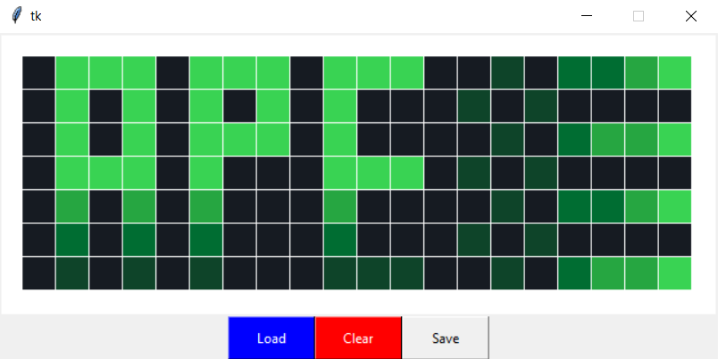

# GitHub Contributions Painter

Paints a bit image on the grid for GitHub Contributions

## 📓 Details

Uses the GitHub actions workflow in [draw.yml](.github/workflows/draw.yml) to commit to repo

1) Runs `main.py` to get the commit count for the current day   
This is determined by offset into `image.txt`  
     
2) Commits a bump the required times to [bump](bump) file and pushes to same repo  
   Requires a [PAT_TOKEN](https://docs.github.com/en/actions/security-guides/automatic-token-authentication#about-the-github_token-secret) secret in the Actions workflow to push the changes  
   Requires GitHub `USERNAME` configured as a secret for the Actions Workflow.  
Requires GitHub `EMAIL` configured as actions secret.  

## 🥼 Usage 

1: Clone the repo   
2: Set the required Actions secrets on the repo - [Steps here](https://docs.github.com/en/actions/security-guides/encrypted-secrets#creating-encrypted-secrets-for-a-repository)
```yaml
PAT_TOKEN: Token with write permission for the repo
USERNAME:  Must match the GitHub Username for the User. 
EMAIL: Email for GitHub User
``` 
3: Generate an image using the `painter.py` file. _Details below_  
4: Commit & Push the required image to the repository  
5: Wait patiently for results. . . 🥱

> **PAT_TOKEN** is required to automatically push files as the intended user  
> 
> Recommended approach is to use a [personal fine-grained personal access token](https://docs.github.com/en/authentication/keeping-your-account-and-data-secure/creating-a-personal-access-token#creating-a-fine-grained-personal-access-token) restricted to just the Repository required and with the following permissions:
> - Read & Write access to code
> - Read access to metadata

## 🖌 Painter GUI 

Users can use the helper **painter.py** GUI to draw bit images for printing

```
python painter.py
```

This GUI supports the following functionality:

> **Draw:**  Color squares by clicking. 5 color levels supported  
**Load:**  Load the most recent image from `INPUT_IMAGE_PATH`  
**Clear:** Clear the grid    
**Save:**  Save the image to `INPUT_IMAGE_PATH`  




## 🔑 Environment Variables

The following environment variables are used in the python scripts

| Key | Value | Desc |
| --- | ---| ---|
| INPUT_IMAGE_PATH | `image.txt` | The path to save/load/generate the bit image from |
